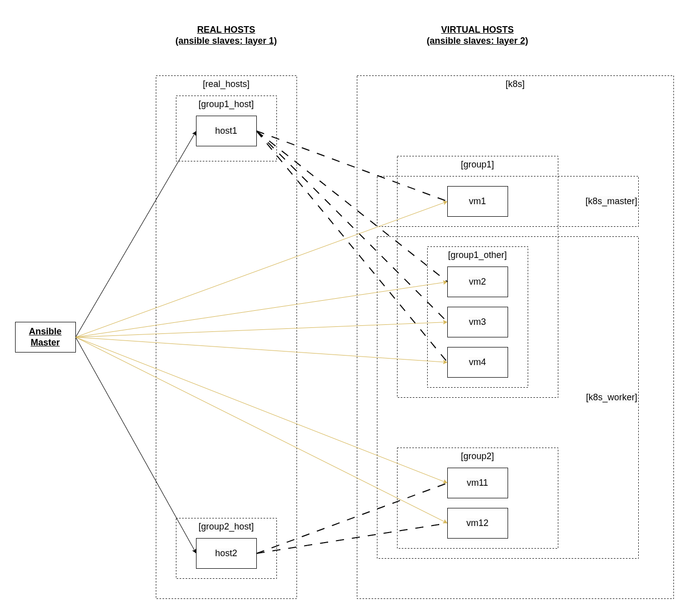

# complex Kubernetes scheme

установка K8S в home network (LAN)

#### Setup
* несколько (2-3) реальных машин. они служат для запуска вирталок и далее их во внимание не берем
* по несколько одинаковых виртуалок на каждой реальной машине
    * ubuntu 24.04 LTS
    * в режиме network bridge - получают собственный IP
* в результате в рабочей схеме остаются только виртуалки

 <br>

#### Questions
* применим ли тут ansible?
    * сначала кажется, что нет или не полностью
        * для ansible нужны установленные целевые виртуалки. делать это придется вручную. тогда можно и весь K8S настроить руками
        * к виртуалкам придется иметь доступ заранее: установка sshd
    * но можно настроить реальные машины для автоматической установки и настройки виртуалок
        * ...
    * тогда через ansible можно сделать и установку виртуалок на реальные машины, и настройку виртуалок
        * просто использовать 2 разных inventory для этих стадий

#### Technologies
* ansible
* kubernetes
* nginx
* ...

======================

#### Preparation

настройка виртуальных машин сначала ручная

// компы то недоступны друг другу, то могут достучаться до apt update
что не надо делать:
1) делать static IP на роутере - для каждой виртуалки
2) ставить похожие MAC-адреса на виртуалки
3) ставить dhcp IP на виртуалках
4) решать проблему с недоступностью apt update через
    * https://askubuntu.com/questions/91543/apt-get-update-fails-to-fetch-files-temporary-failure-resolving-error
    * echo "nameserver 208.67.222.222" | sudo tee /etc/resolvconf/resolv.conf.d/base > /dev/null
    * потому что у убунты не /etc/resolvconf/resolv.conf.d/base

а надо:
1) похожие static IP на виртуалках + manual DNS server 208.67.222.222

установка ssh-server + доступ по паролю
* sudo apt update
* sudo apt install openssh-server
* sudo systemctl enable ssh
* sudo systemctl restart ssh

======================

#### Start ansible

```# git clone <this repo>
# cd k8sss/big-sheme
---
# python3 -m venv venv
# . ./venv/bin/activate
# python3 -m pip install --upgrade pip
# pip install ansible
```

создать файл hosts и добавить туда все установленные виртуалки
```
# touch hosts
```

запуск
```
# ansible-playbook install.yml
```

Запуск не сначала
```
# ansible-playbook -vv --start-at-task "Install containerd - on all nodes" install.yml
```

Либо запуск только определенного Play (по тэгу)
```
ansible-playbook clean.yml --tags k8s_cluster_del, k8s_tools_del
```

пошаговое выполнение ansible playbook
```
# ansible-playbook install.yml --step
```

