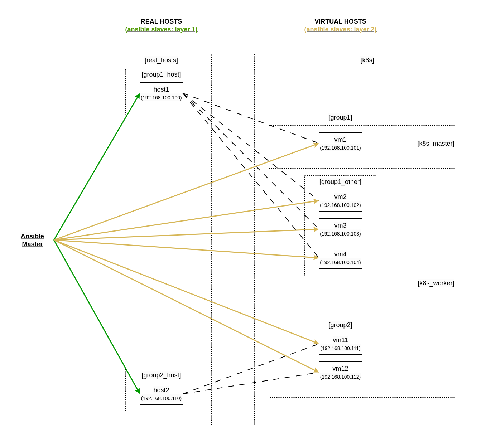

# Install Kubernetes cluster (1 master - multiple workers) with kubeadm

Установка K8S в home network (LAN). Схема "One master - multiple workers" - используется одна Control Node. <br>
Установка с помощью kubeadm и DIY ansible playbooks <br>


#### Setup
* несколько физических машин (2-5). они служат для запуска вирталок и далее мы абстрагируемся от них
    * ubuntu 24.04 LTS
    * устанавливаются вручную
    * есть вариант автоматической установки: Ubuntu Server (.iso image + autoinstall.yaml) или Debian (cloud .qcow2 image)
    * к ним есть доступ по ssh - это ansible slaves первого уровня (Virtualization Layer)
* по несколько одинаковых виртуалок на каждой реальной машине
    * ubuntu 24.04 LTS
    * в режиме network bridge - получают собственный IP
    * к ним есть доступ по ssh - это ansible slaves второго уровня (K8s cluster)
* ansible (11.8.0) - python pip
* kubernetes (v1.32)


 <br>


#### Warning
Из-за ручной настройки (DIY ansible playbook) данный проект воспроизводится в сторго указанных рамках. Обновление K8s, ubuntu, смена ubuntu на debian, смена версий Python или Ansible в pip requirements - все это приведет к поломке и придется вносить небольшие правки. <br>
Проект является учебной демонстрацией структуры и взаимосвязи компонентов K8s, абстрагирования кластера от уровня виртуальных машин <br>
НО: даже сейчас это не **Kubernetes The Hard Way** - полностью ручной способ установки кластера. Мы используем kubeadm, который частично автоматизирует настройку виртуальных Nodes и из связывание в K8s кластер.<br>


#### Prepare VMs

настройка виртуальных машин: static IP + manual DNS server 208.67.222.222

установка ssh-server + доступ по паролю
* sudo apt update
* sudo apt install openssh-server
* sudo systemctl enable ssh
* sudo systemctl restart ssh


#### Prepare Python virtual env with ansible

создать файл hosts и добавить туда все установленные виртуалки
```
# touch hosts
```

```# git clone <this repo>
# cd k8sss/one-master-kubeadm            # enter working directory
---
# python3 -m venv venv                   # # # create Python virtual env (only on first launch)
# . venv/bin/activate                    # enter to the python virtual env
# python3 -m pip install --upgrade pip   # # # upgrade pip (only on first launch)
# pip install -r requirements.txt        # # # install project requirements (only on first launch)
# ansible-playbook install.yml           # start Ansible playbooks
```

Запуск не сначала
```
# ansible-playbook -vv --start-at-task "Install containerd - on all nodes" install.yml
```

Либо запуск только определенного Play (по тэгу) из Playbook-а
```
ansible-playbook clean.yml --tags k8s_cluster_del, k8s_tools_del
```

пошаговое выполнение ansible playbook
```
# ansible-playbook install.yml --step
```

