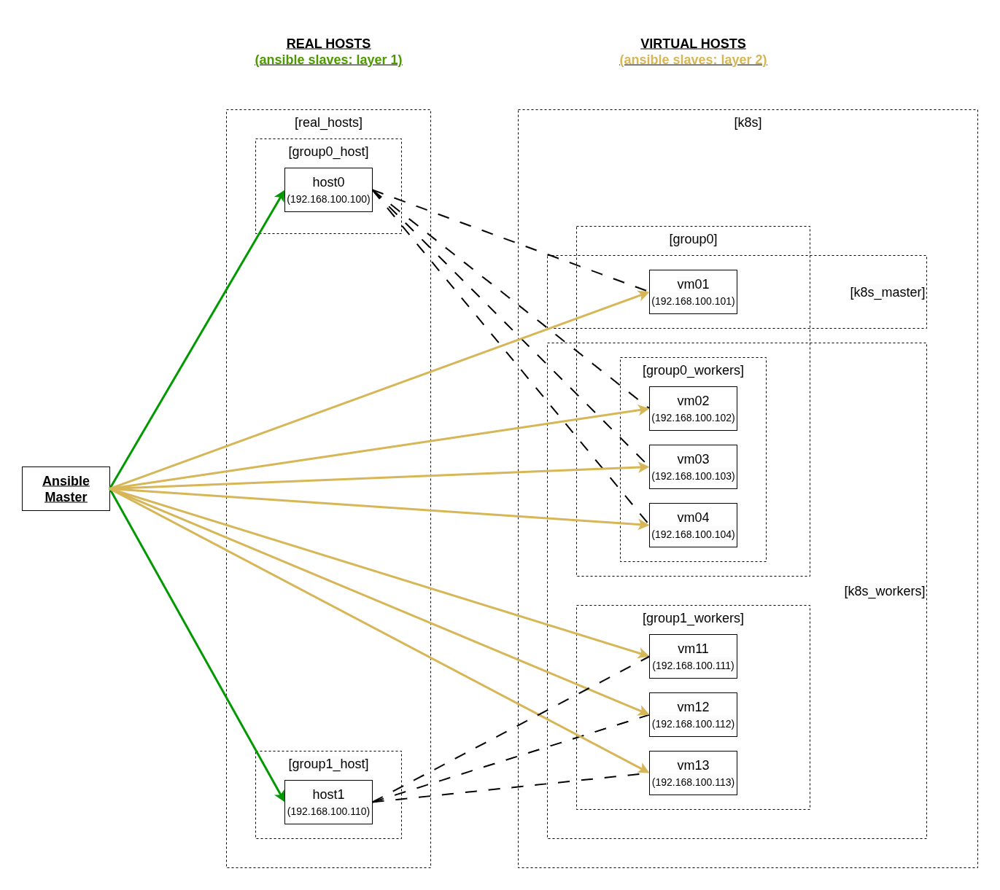

# Install Kubernetes cluster (1 master - multiple workers) with kubeadm

установка K8S в home network (LAN)

#### Setup
* несколько (2-3) реальных машин. они служат для запуска вирталок и далее их во внимание не берем
* по несколько одинаковых виртуалок на каждой реальной машине
    * ubuntu 24.04 LTS
    * в режиме network bridge - получают собственный IP
* в результате в рабочей схеме остаются только виртуалки

 <br>


#### Technologies
* ansible
* kubernetes


#### Prepare VMs

настройка виртуальных машин: static IP + manual DNS server 208.67.222.222

установка ssh-server + доступ по паролю
* sudo apt update
* sudo apt install openssh-server
* sudo systemctl enable ssh
* sudo systemctl restart ssh


#### Prepare Python virtual env with ansible

```# git clone <this repo>
# cd k8sss/one-master-kubeadm
---
# python3 -m venv venv
# . ./venv/bin/activate
# python3 -m pip install --upgrade pip
# pip install ansible
```

создать файл hosts и добавить туда все установленные виртуалки
```
# touch hosts
```

#### Start Ansible playbooks

запуск
```
# ansible-playbook install.yml
```

Запуск не сначала
```
# ansible-playbook -vv --start-at-task "Install containerd - on all nodes" install.yml
```

Либо запуск только определенного Play (по тэгу) из Playbook-а
```
ansible-playbook clean.yml --tags k8s_cluster_del, k8s_tools_del
```

пошаговое выполнение ansible playbook
```
# ansible-playbook install.yml --step
```

